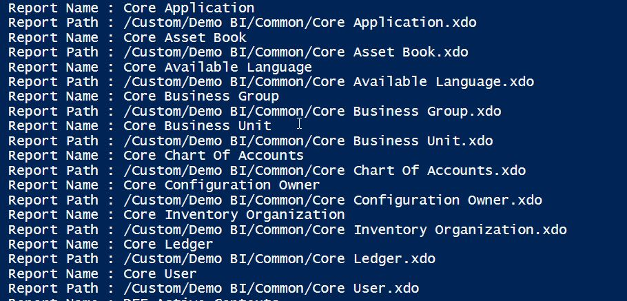

## Fetch Report Name and Report Path from Oracle Cloud BI

#### Problem Statement
Fetch all the report names along wih the path in a given folder in Oracle BI Cloud

#### How To Use the Files
  - Copy and paste the PowerShell File and the SOAP Payload File into a folder
  - Modify the SOAP Payload and provide the correct user name and password details
  - Modify the PowerShell Script and provide the correct URL to your Oracle Cloud BI Environment
  - Save and Execute the PowerShell

#### Sample Output

